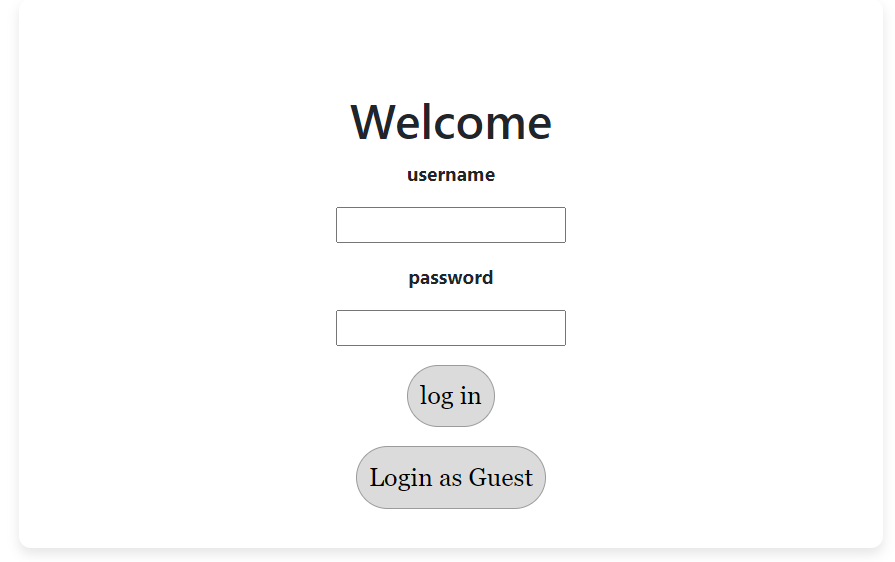

# README

# Library-Manager-Frontend

Front-end part of an app--written with plain JS, HTML, CSS and a little PHP-responsible for managing the variety of activities that take place in a library.

## Introduction

This repository is the second part of the **Library Manager** application, so I recommend installing the preceding part of this repository ([Library-Manager-Backend](https://github.com/amirrezasokhankhosh/Library-Manager-Backend)) at first.

This application should have 2 user types. **Admin-user** which is responsible for the management of books, memberships, and borrowing books. **Guest-user** which gives non-staff individuals the ability to search through the database for books. This search can be based on author, book’s name, and its publication.

## Required Applications

- XAMPP (if you want to run on your personal system)

## How to Use

- First, run `Apache` and `MySQL` in XAMPP.
- After that, move the repository to `C:\xampp\htdocs` so that you can run PHP on your machine.
- Then, using `phpmyadmin ([http://localhost/phpmyadmin/](http://localhost/phpmyadmin/))`  create a database named **`library_users`.**
- Run `library_users.sql` file inside your database
- If you have installed and configured the first part (Back-end) as well, you can now use the application.

## Application (V1.0.0)

Open [`http://localhost/Library_Manager_Frontend/login.php`](http://localhost/Library_Manager_Frontend/login.php) on your browser. You should see a web page like below.

Initially, I have defined a temporary username. You can login with `**username : temp, password : temp`** or as a guest.

If you login as a guest, you will only be able to search in the database.

But when you sign in with the mentioned username and password you also see some buttons about other management functions of the library. However, these functionalities are not implemented yet. 

A search result:

